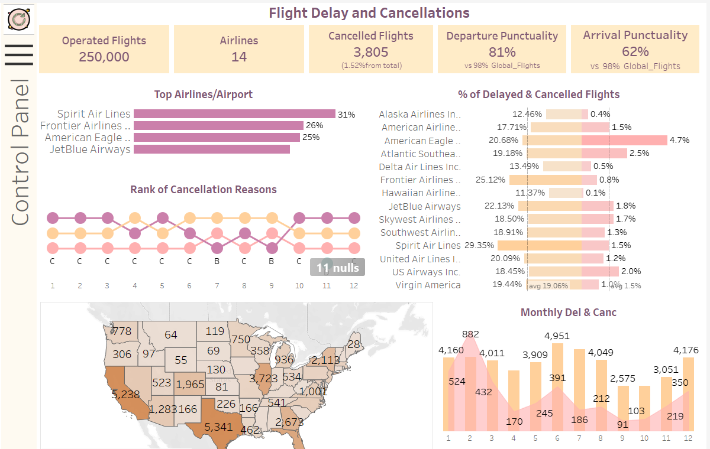

# Flight Delay and Cancellations Analysis (2015)

## Project Overview

This project focuses on analyzing flight delays and cancellations for the year 2015. The goal is to provide insights into the performance of airlines and airports, identify patterns in delays and cancellations, and suggest potential solutions to improve operational efficiency. The analysis is presented in an interactive Tableau dashboard, designed to be user-friendly and informative for business stakeholders.

### Tableau Public Link
You can explore the interactive dashboard here:  
[Flight Delay and Cancellations 2015 Dashboard](https://public.tableau.com/views/FlightDelayandCancellations2015Year_Ivanna/FlightDelayandCancellations2015Year9?:language=en-US&:sid=&:redirect=auth&:display_count=n&:origin=viz_share_link)

---

## Project Concept

The project was developed as part of a task for a transportation ministry department. The objective was to analyze flight data from various airlines and airports, compare their performance, and identify outliers in terms of delays and cancellations. The dashboard provides insights into patterns and potential causes of flight delays, offering actionable recommendations to improve operational efficiency and reduce disruptions.

---

## Project Goals

1. **Data Exploration**: Investigate the dataset, build a data model by joining tables using keys (airport codes and airline codes), and uncover valuable business insights.
2. **Dashboard Development**: Create an interactive and visually appealing dashboard with a focus on:
   - Clear and logical structure.
   - Business-relevant insights.
   - Interactive features for user engagement.
3. **Technical Implementation**:
   - Build a data model using physical joins.
   - Display key quantitative data using KPI metrics.
   - Show the ratio of canceled or delayed flights to the total number of flights (broken down by airports or airlines).
   - Visualize data trends over time using timelines.
   - Use parameters to switch between different data views or visualizations.
   - Implement dual-axis visualizations.
   - Incorporate various types of filters (date, measure, dimension).
   - Enable user interaction with dashboard elements (actions, tooltips, set actions).
   - Apply data visualization best practices (Gestalt principles, color schemes, layout, and spacing).

---

## Key Features of the Dashboard

- **KPI Metrics**: Key performance indicators for flight delays and cancellations.
- **Time Analysis**: Trends and patterns over time.
- **Comparative Analysis**: Performance comparison between airports and airlines.
- **Interactive Filters**: Customizable views based on dates, airlines, and airports.
- **User-Friendly Design**: Intuitive layout and visual hierarchy for easy navigation.

---

## Technical Details

### Data Model
- Tables were joined using airport and airline codes to create a unified dataset.
- Calculated fields were created to derive key metrics such as delay rates and cancellation percentages.

### Visualizations
- Dual-axis charts for comparative analysis.
- Timelines to show trends over time.
- Interactive filters and parameters for dynamic data exploration.

### Dashboard Layout
- The dashboard was designed using Gestalt principles for visual clarity.
- Containers and spacing were used to group related elements logically.

---

## How to Use the Dashboard

1. Open the Tableau Public link provided above.
2. Use the filters to explore data by date, airline, or airport.
3. Hover over visualizations to view tooltips and additional details.
4. Switch between different views using parameters and set actions.

---

## License

This project is open-source and available under the [MIT License](LICENSE).
